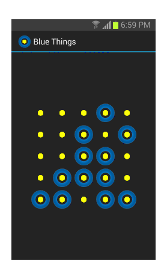

Blue Things 
===========

A nice, simple game. Press on a yellow dot. Its neighbours will get blue things. Press again. Press somewhere else. Enjoy beauty.

Q: Can you add options like more dots or different colors?  
A: Yes. But I won't, because I like to keep it plain and simple.

Q: What is the purpose?  
A: To waste time with beautiful dots and blue things.

Q: I love it. Can I donate?  
A: Please instead donate to EDRI. The members of EDRI (European Digital Rights in Europe) defend civil rights in the information society. http://www.edri.org/about/sponsoring

Copyright © 2013 Aja Apps.  This work is free. You can redistribute it and/or
modify it under the terms of the Do What The Fuck You Want To Public License,
Version 2, as published by Sam Hocevar. See http://www.wtfpl.net/ for more
details.

Source code and issue tracker reside at https://github.com/ajaapps/bluethings .

